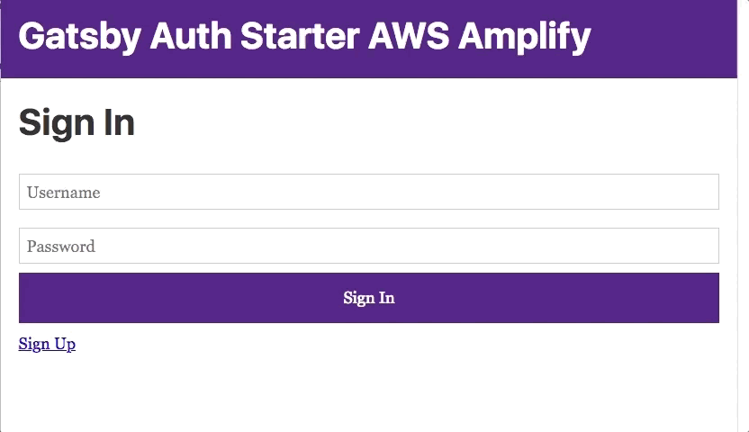

# Converting Javascript to ReasonML


## Gatsby Auth starter with AWS Amplify

### Mostly ripped from [@dabit3](https://twitter.com/dabit3)'s [gatsby-auth-starter-aws-amplify](https://github.com/dabit3/gatsby-auth-starter-aws-amplify)

This auth starter implements a basic authentication flow for signing up signing in users as well as protected client side routing using [AWS Amplify](https://amplify.aws). Auth features:

- User sign up
- User sign in
- Multi-factor Authentication
- User sign-out



## Getting Started

1. Create the project using the version from the pull request to fix the graphql issue.

```sh
gatsby new gatsby-amplify-auth https://github.com/shawnmmatthews/gatsby-auth-starter-aws-amplify.git
```

2. Change into the new directory

```sh
cd gatsby-amplify-auth
```

3. Change into the new directory

```sh
yarn
# or
npm install
```

4. Install & configure the AWS Amplify CLI. Note: we're going to be using the multi environment CLI version as it is the newest version.

```sh
npm install -g @aws-amplify/cli@multienv

amplify configure
```

> To see a video of how to configure the CLI, click [here](https://www.youtube.com/watch?v=fWbM5DLh25U)

5. Create a new AWS Amplify Project

```
amplify init
```

> Here, walk through the following steps:

- Enter a name for the project __YOURPROJECTNAME__
- Enter a name for the environment __master__
- Choose your default editor: __Visual Studio Code__ (or your editor of choice)
- Choose the type of app that you're building __javascript__
- What javascript framework are you using __react__
- Source Directory Path: __src__
- Distribution Directory Path: __public__
- Build Command: __npm run-script build__
- Start Command: __npm run-script develop__

6. Push the updated project configuration to AWS. It will deploy a CloudFormation template that has an Amazon Cognito resource that enables user authentication.

```sh
amplify push
```

7. Then you can run it to make sure it works:
```sh
gatsby develop
```

8. Add ReasonML dependencies, create `bsconfig.json` file:
```sh
yarn add bs-platform reason-react && touch bsconfig.json
```

9. Add config to bsconfig.json, make sure to add `reason-react` to `bs-dependencies`.

10. Add bsb scripts to `package.json`:

```json
...
"dev": "gatsby develop",
"watch": "bsb -make-world -w",
"clean": "bsb -clean-world",
...
```

## Converting to ReasonML

Lets try some low hanging fruit first to see if we can get it to work.
This might be tricky since Gatsby is basically a build system with all kinds of rules we need to adhere to regarding file/folder structure and file naming conventions. So we will just try stuff, get errors, and figure out the errors as we go.

If we look at `index.js` we can see that it exports a component called `IndexPage`. Gatsbyjs expects that there is an `index.js` in the `/pages` [directory](https://www.gatsbyjs.org/tutorial/part-one/#familiarizing-with-gatsby-pages). So we are going to have to reproduce exporting an a component called `IndexPage` from `index.js` using Reason. We need to duplicate this for this transformation to work. We can achieve this by creating a new file in this same pages directory called `indexPage.re`. We will name our component `IndexPage` but it doesn't really matter as we will be exporting whatever is in this file as default and re-exporting it.

This is what this simple page looks like in reason:

```reason
/* create a text element so we dont have to keep writing ReasonReact.string.
So now we can do (text("Hi People")) instead of ReasonReact.string("Hi People")
*/
let text = ReasonReact.string;
let make = _children => {
  ...component,
  render: _self =>
    <div>
      <h1> (text("Hi People")) </h1>
      <p> (text("Welcome to your new Gatsby site.")) </p>
      <p> (text("Welcome to your new Gatsby site with multi-user authentication powered by"))<a href="https://amplify.aws">(text("AWS Amplify"))</a></p>
      <p> (text("Create a new account: "))<GatsbyLink to_="/app/signup">(text("Sign Up"))</GatsbyLink></p>
      <GatsbyLink to_="/app/login"> (text("Sign In"))</GatsbyLink><br />
      <GatsbyLink to_="/app/home"> (text("Home"))</GatsbyLink><br />
      <GatsbyLink to_="/app/profile"> (text("Your Profile"))</GatsbyLink>
    </div>
};
```

To deal with `GatsbyLink` I searched github with the following search `GatsbyLink extension:.re` [search](https://github.com/search?q=GatsbyLink+extension%3A.re&type=Code) to see if anyone else had done it. I then investigated the results to see how they did it. It turns out they used a package called [gatsby-link-reason](https://github.com/jtberglund/gatsby-link-reason) which we can install with `yarn add gatsby-link-reason`. Go ahead and do that the add it to `bs-dependencies` in `bsconfig.json`. Which should now look like this:

```json
  "bs-dependencies": ["reason-react","gatsby-link-reason"],
```

After doing that, I had to re-run `yarn watch` for the index.re to compile. I then went to `index.re` and it still showed the red squiggly error marks. I'm in vscode so I hit CMD+SHIFT+P to open the command pallet and started typing `Reload Window` which is a command that will reload your vscode window. The error then went away.

As we are going to be using this file on the javascript side, we need to export it in a way that javascript can use it. This is called [interop](https://reasonml.github.io/reason-react/docs/en/interop#reactjs-using-reasonreact) and we export it by add the following line to the bottom of our file.

```js
let default =
ReasonReact.wrapReasonForJs(~component, jsProps => make(jsProps##children));
```

The last thing we need to do to actually get this to work is change `index.js` so that it uses `index.re`.

Change `index.js` by replacing everything in it with the following:

```js
export { default } from "./indexPage.bs";
```

Once I did this I got a couple of warnings errors that I had to work through even though the file compiled. First, my terminal, gatsby threw `use strict` eslint warning. I hit [google](https://www.google.com/search?hl=en&q=gatsby%20eslint%20disable%20false%20%2D%20disable%20warnings%20about%20strict%20mode) clicked the second result which was a recent [issue](https://github.com/gatsbyjs/gatsby/issues/5763) on the gatsby repo. The suggested add a blank `.eslintrc` to the root directory to overide the default config. Gatsby uses a default config since many devs, including me, have not mastered [eslint](https://eslint.org/.). The truth is, I use reason to avoid all this eslint, javascript error foolishness. So i added the `.eslintrc` and the gatsby terminal output cleared up. I then got an error in `index.js` from the vscode eslint service. Back to Google to discover that I could disable the eslint checker in vscode via this [stackoverflow](https://stackoverflow.com/questions/35939042/disable-eslint-parser-error-messages-vscode) post. I opened up setting in vscode by clicking `code->preferences->settings` from the top menu. I then typed in eslint, then looked for the `EsLint:Enable` box and unchecked it. The error went away. I don't know if this will cause additional issues later but my gut instinct is I dont care because I am not using JS for anything but importing reasonML.

Yes, people, this is how development looks for me. Feel free to suggest a better way if there is one. Thanks in advance.

Now run `yarn dev` or `gatsby develop` and check your browser. We should have the same result as we previously had from `index.js`.

Show me the [code](https://github.com/idkjs/converting-js-to-reason-tutorial).